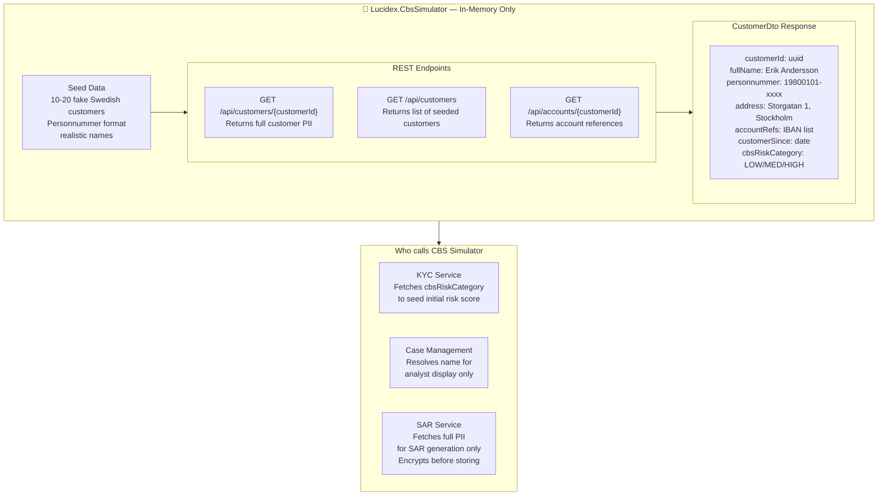

# CBS Simulator

## Overview

The **CBS Simulator** is an in-memory mock of the Core Banking System (CBS). It serves as the **source of truth for all customer PII** (names, addresses, personnummer, account references) in the Lucidex system.

**Key Characteristics:**
- ✅ In-memory only (no persistence)
- ✅ 10-20 seeded fake Swedish customers
- ✅ Realistic data format (personnummer, IBAN accounts)
- ✅ REST API with typed HttpClient integration
- ✅ **Perfect swap point** for real CBS API in production

**Why CBS Simulator?**
Lucidex is a compliance layer that should **never store PII**. The CBS Simulator demonstrates how to fetch customer data on-demand without persisting it locally. When integrating with a real banking system, replace this simulator with actual CBS endpoints.

---

## Architecture



---

## REST Endpoints

### GET /api/customers/{customerId}

Returns full customer PII for a specific customer.

**Response:**
```json
{
  "customerId": "550e8400-e29b-41d4-a716-446655440000",
  "fullName": "Erik Andersson",
  "personnummer": "19800101-1234",
  "address": "Storgatan 1, Stockholm",
  "accountRefs": [
    "SE4550000000058398257466",
    "SE4550000000058398257467"
  ],
  "customerSince": "2015-03-20",
  "cbsRiskCategory": "MEDIUM"
}
```

**Usage:**
- **KYC Service**: Fetches `cbsRiskCategory` to initialize risk profile
- **SAR Service**: Fetches full response for SAR document generation
- **Case Management**: Fetches `fullName` and `address` for analyst display

---

### GET /api/customers

Returns list of all seeded customers (simplified response).

**Response:**
```json
[
  {
    "customerId": "550e8400-e29b-41d4-a716-446655440000",
    "fullName": "Erik Andersson",
    "cbsRiskCategory": "MEDIUM"
  },
  {
    "customerId": "6ba7b810-9dad-11d1-80b4-00c04fd430c8",
    "fullName": "Maria Svensson",
    "cbsRiskCategory": "LOW"
  }
]
```

---

### GET /api/accounts/{customerId}

Returns account references for a customer.

**Response:**
```json
{
  "customerId": "550e8400-e29b-41d4-a716-446655440000",
  "accountRefs": [
    "SE4550000000058398257466",
    "SE4550000000058398257467"
  ]
}
```

---

## Integration Points

### KYC Service
**Purpose:** Fetch risk category for risk scoring

```csharp
// Fetch from CBS
var customerData = await _cbsClient.GetCustomerAsync(customerId);

// Use CBS risk category + rules to calculate AML risk score
var riskScore = CalculateRiskScore(customerData.cbsRiskCategory);

// Store in Lucidex DB (no PII)
await _db.UpsertRiskProfile(new RiskProfile 
{
    CustomerId = customerId,
    RiskScore = riskScore,
    RiskLevel = DetermineLevel(riskScore)
});
```

### Case Management
**Purpose:** Enrich case list with customer names (display-time only)

```csharp
// Get cases from Lucidex DB (IDs only)
var cases = await _db.GetCasesAsync();

// For each case, fetch name from CBS for display
foreach (var case in cases)
{
    var customer = await _cbsClient.GetCustomerAsync(case.CustomerId);
    case.CustomerName = customer.fullName; // Display only, not stored
}

// Return to Portal UI
return cases;
```

### SAR Service
**Purpose:** Fetch full PII for SAR document generation

```csharp
// Get case details from Lucidex DB
var case = await _db.GetCaseAsync(caseId);

// Fetch full customer PII from CBS
var customer = await _cbsClient.GetCustomerAsync(case.CustomerId);

// Build SAR document with PII
var sarContent = GenerateSarDocument(case, customer);

// Encrypt before storing
var encrypted = AesEncryption.Encrypt(sarContent);

// Store encrypted blob in DB (no plaintext PII)
await _db.InsertSarDraftAsync(new SarDraft
{
    CaseId = caseId,
    CustomerId = case.CustomerId,
    EncryptedContent = encrypted,
    Status = "DRAFT"
});
```

---

## Seed Data

The CBS Simulator comes with 10-20 pre-seeded fake Swedish customers:

| CustomerId | Name | Personnummer | Risk Category |
|-----------|------|---------------|---------------|
| 550e8400-... | Erik Andersson | 19800101-1234 | MEDIUM |
| 6ba7b810-... | Maria Svensson | 19850515-5678 | LOW |
| ... | ... | ... | ... |

All data is in-memory only. Restarting the service resets to seed data.

---

## Production Integration

### Swap CBS Simulator for Real CBS

To integrate with a real banking system:

1. **Create interface implementation** (already exists via `ICustomerDataSource`)

```csharp
public interface ICustomerDataSource
{
    Task<CustomerDto> GetCustomerAsync(Guid customerId);
    Task<List<CustomerDto>> GetAllCustomersAsync();
    Task<AccountDto> GetAccountsAsync(Guid customerId);
}
```

2. **Register real CBS client in DI container**

```csharp
// Before (local development)
services.AddSingleton<ICustomerDataSource, CbsSimulator>();

// After (production)
services.AddScoped<ICustomerDataSource, RealCbsClient>();
```

3. **Implement RealCbsClient** with actual CBS API calls (same interface)

No service code changes required — the abstraction handles the swap.

---

## Security & Privacy

### PII Handling
- ✅ PII never persists in Lucidex
- ✅ Fetched on-demand from CBS only when needed
- ✅ Immediately used for purpose (risk scoring, display, SAR generation)
- ✅ Lucidex DB stores only encrypted SARs and references

### Encryption
- SAR documents encrypted with AES-256 before storage
- Encryption key managed via environment variable / Kubernetes secret
- Only encrypted blobs stored in database

### Audit Trail
- All CBS API calls logged to Seq with correlation IDs
- AuditLog table tracks when customer data was accessed
- Compliance-ready for GDPR Subject Access Requests

---

## Development Notes

### Running Locally

```bash
# Start all services with docker-compose
docker-compose up -d

# CBS Simulator runs at http://localhost:8085
# Test endpoint
curl http://localhost:8085/api/customers

# Or use Portal UI to trigger CBS calls
# Navigate to http://localhost:8080
```

### Testing CBS Integration

Use Testcontainers in integration tests to verify CBS calls:

```csharp
[Fact]
public async Task KycService_FetchesFromCbs_AndStoresRiskProfile()
{
    // Arrange
    var cbsSimulator = new CbsSimulator();
    var customerId = cbsSimulator.SeedCustomers()[0].CustomerId;

    // Act
    var riskProfile = await _kycService.AssessRiskAsync(customerId);

    // Assert
    Assert.NotNull(riskProfile);
    Assert.Equal(customerId, riskProfile.CustomerId);
}
```

---

## Future Enhancements

- **Caching**: Add Redis layer to reduce CBS calls for RiskProfiles
- **Real CBS Integration**: Replace simulator with actual banking API
- **Advanced Risk Scoring**: Integrate customer transaction history from CBS
- **Account Linking**: Track accounts per customer in Lucidex for better monitoring
