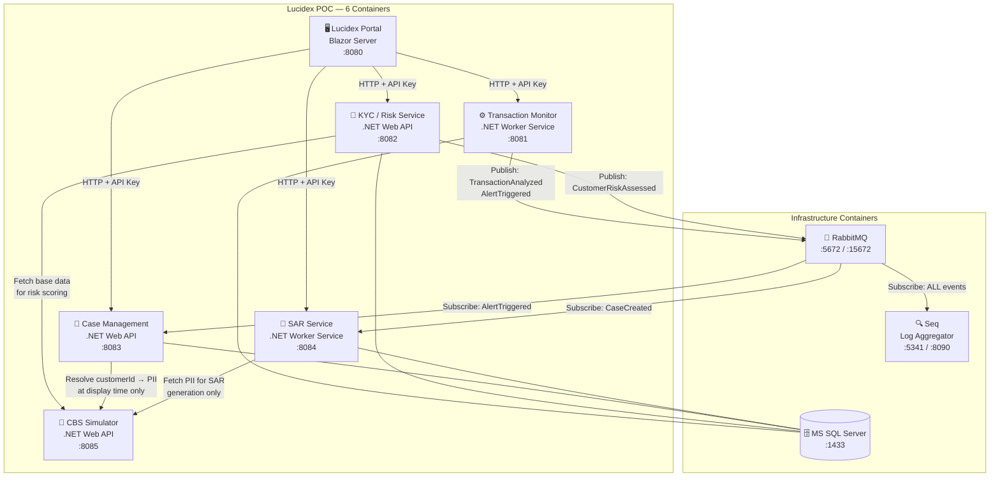

```mermaid
graph TB
    subgraph POC["Lucidex POC — 6 Containers"]
        UI[🖥️ Lucidex Portal\nBlazor Server\n:8080]
        TXM[⚙️ Transaction Monitor\n.NET Worker Service\n:8081]
        KYC[👤 KYC / Risk Service\n.NET Web API\n:8082]
        CMS[📁 Case Management\n.NET Web API\n:8083]
        SAR[📄 SAR Service\n.NET Worker Service\n:8084]
        CBS[🏦 CBS Simulator\n.NET Web API\n:8085]
    end

    subgraph INFRA["Infrastructure Containers"]
        MQ[🐇 RabbitMQ\n:5672 / :15672]
        DB[(🗄️ MS SQL Server\n:1433)]
        SEQ[🔍 Seq\nLog Aggregator\n:5341 / :8090]
    end

    UI -->|HTTP + API Key| TXM
    UI -->|HTTP + API Key| KYC
    UI -->|HTTP + API Key| CMS
    UI -->|HTTP + API Key| SAR

    TXM -->|Publish: TransactionAnalyzed\nAlertTriggered| MQ
    KYC -->|Publish: CustomerRiskAssessed| MQ
    MQ -->|Subscribe: AlertTriggered| CMS
    MQ -->|Subscribe: CaseCreated| SAR
    MQ -->|Subscribe: ALL events| SEQ

    KYC -->|Fetch base data\nfor risk scoring| CBS
    CMS -->|Resolve customerId → PII\nat display time only| CBS
    SAR -->|Fetch PII for SAR\ngeneration only| CBS

    TXM --- DB
    KYC --- DB
    CMS --- DB
    SAR --- DB
```