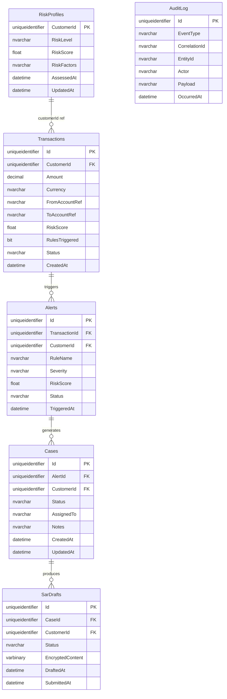

```mermaid
erDiagram
    RiskProfiles {
        uniqueidentifier CustomerId PK
        nvarchar RiskLevel
        float RiskScore
        nvarchar RiskFactors
        datetime AssessedAt
        datetime UpdatedAt
    }

    Transactions {
        uniqueidentifier Id PK
        uniqueidentifier CustomerId FK
        decimal Amount
        nvarchar Currency
        nvarchar FromAccountRef
        nvarchar ToAccountRef
        float RiskScore
        bit RulesTriggered
        nvarchar Status
        datetime CreatedAt
    }

    Alerts {
        uniqueidentifier Id PK
        uniqueidentifier TransactionId FK
        uniqueidentifier CustomerId FK
        nvarchar RuleName
        nvarchar Severity
        float RiskScore
        nvarchar Status
        datetime TriggeredAt
    }

    Cases {
        uniqueidentifier Id PK
        uniqueidentifier AlertId FK
        uniqueidentifier CustomerId FK
        nvarchar Status
        nvarchar AssignedTo
        nvarchar Notes
        datetime CreatedAt
        datetime UpdatedAt
    }

    SarDrafts {
        uniqueidentifier Id PK
        uniqueidentifier CaseId FK
        uniqueidentifier CustomerId FK
        nvarchar Status
        varbinary EncryptedContent
        datetime DraftedAt
        datetime SubmittedAt
    }

    AuditLog {
        uniqueidentifier Id PK
        nvarchar EventType
        nvarchar CorrelationId
        nvarchar EntityId
        nvarchar Actor
        nvarchar Payload
        datetime OccurredAt
    }

    RiskProfiles ||--o{ Transactions : "customerId ref"
    Transactions ||--o{ Alerts : "triggers"
    Alerts ||--o{ Cases : "generates"
    Cases ||--o{ SarDrafts : "produces"
```