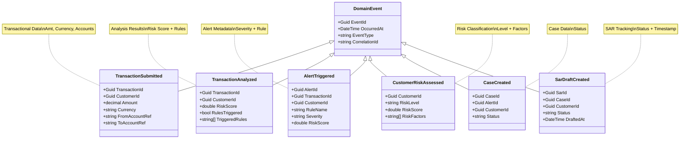

```mermaid
classDiagram
    class DomainEvent {
        +Guid EventId
        +DateTime OccurredAt
        +string EventType
        +string CorrelationId
    }

    class TransactionSubmitted {
        +Guid TransactionId
        +Guid CustomerId
        +decimal Amount
        +string Currency
        +string FromAccountRef
        +string ToAccountRef
    }

    class TransactionAnalyzed {
        +Guid TransactionId
        +Guid CustomerId
        +double RiskScore
        +bool RulesTriggered
        +string[] TriggeredRules
    }

    class AlertTriggered {
        +Guid AlertId
        +Guid TransactionId
        +Guid CustomerId
        +string RuleName
        +string Severity
        +double RiskScore
    }

    class CustomerRiskAssessed {
        +Guid CustomerId
        +string RiskLevel
        +double RiskScore
        +string[] RiskFactors
    }

    class CaseCreated {
        +Guid CaseId
        +Guid AlertId
        +Guid CustomerId
        +string Status
    }

    class SarDraftCreated {
        +Guid SarId
        +Guid CaseId
        +Guid CustomerId
        +string Status
        +DateTime DraftedAt
    }

    DomainEvent <|-- TransactionSubmitted
    DomainEvent <|-- TransactionAnalyzed
    DomainEvent <|-- AlertTriggered
    DomainEvent <|-- CustomerRiskAssessed
    DomainEvent <|-- CaseCreated
    DomainEvent <|-- SarDraftCreated

    note for TransactionSubmitted "Transactional Data\nAmt, Currency, Accounts"
    note for TransactionAnalyzed "Analysis Results\nRisk Score + Rules"
    note for AlertTriggered "Alert Metadata\nSeverity + Rule"
    note for CustomerRiskAssessed "Risk Classification\nLevel + Factors"
    note for CaseCreated "Case Data\nStatus"
    note for SarDraftCreated "SAR Tracking\nStatus + Timestamp"
```