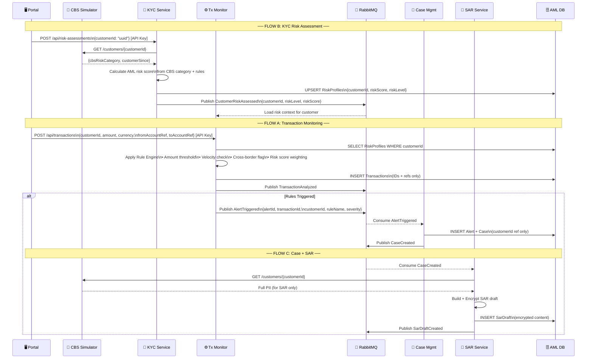
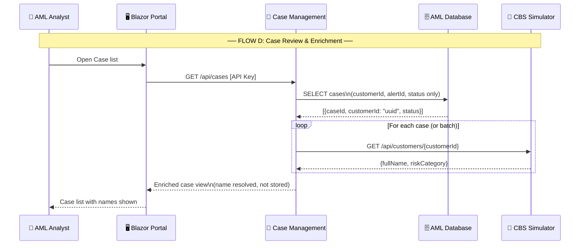
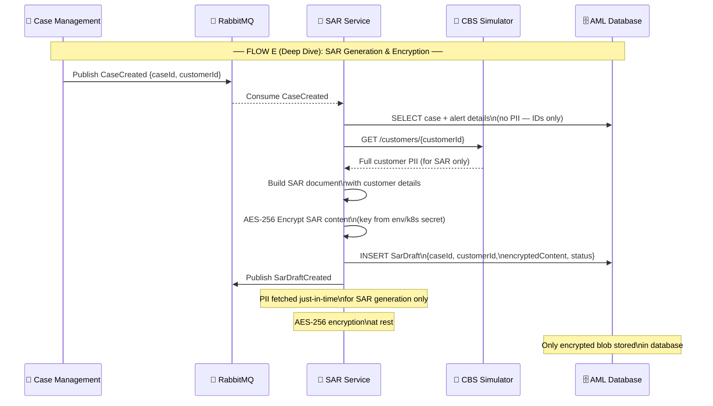

## FLOW A, B, C: Core Business Workflows

**Overview:** The three main system flows showing how customer data flows through the compliance system. Flow B assesses customer risk, Flow A monitors transactions against rules, and Flow C escalates suspicious activity into cases and generates SARs.

- **Flow B**: KYC officer assesses customer risk profile and stores risk classification
- **Flow A**: Transactions analyzed against rule engine (amount thresholds, velocity, cross-border, etc.)
- **Flow C**: Rules triggered → alerts created → cases escalated → SAR generation initiated

---

## FLOW D: Analyst Case Review

**Overview:** How compliance analysts interact with the system to review and investigate flagged cases. Demonstrates the **fetch-on-demand pattern** where customer names are retrieved from CBS only when needed for display, ensuring PII is not stored in the AML database.

**Key Pattern:** AML DB stores only IDs and transaction metadata. Customer names are fetched from CBS at display time for the analyst's UI.

---

## FLOW E (Deep Dive): SAR Generation & Encryption

**Overview:** Detailed technical flow for SAR generation, showing how sensitive customer data is handled securely during SAR document creation. This is the **implementation detail** of FLOW C, highlighting encryption at rest and just-in-time PII retrieval.

**Security Architecture Shown:**
- PII fetched from CBS only when building the SAR
- SAR content encrypted with AES-256 before storage
- Only encrypted blob stored in AML database
- No plaintext sensitive data in logs or database

