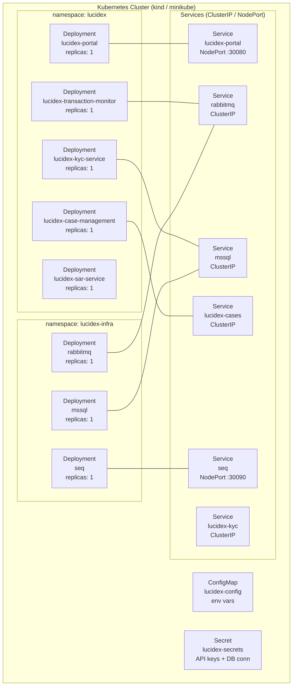

```mermaid
graph TB
    subgraph K8S["Kubernetes Cluster (kind / minikube)"]
        subgraph NS_AML["namespace: lucidex"]
            D1[Deployment\nlucidex-transaction-monitor\nreplicas: 1]
            D2[Deployment\nlucidex-kyc-service\nreplicas: 1]
            D3[Deployment\nlucidex-case-management\nreplicas: 1]
            D4[Deployment\nlucidex-sar-service\nreplicas: 1]
            D5[Deployment\nlucidex-portal\nreplicas: 1]
        end

        subgraph NS_INF["namespace: lucidex-infra"]
            D6[Deployment\nrabbitmq\nreplicas: 1]
            D7[Deployment\nmssql\nreplicas: 1]
            D8[Deployment\nseq\nreplicas: 1]
        end

        subgraph SVC_LAYER["Services (ClusterIP / NodePort)"]
            S1[Service\nlucidex-portal\nNodePort :30080]
            S2[Service\nlucidex-kyc\nClusterIP]
            S3[Service\nlucidex-cases\nClusterIP]
            S4[Service\nrabbitmq\nClusterIP]
            S5[Service\nmssql\nClusterIP]
            S6[Service\nseq\nNodePort :30090]
        end

        CM[ConfigMap\nlucidex-config\nenv vars]
        SEC[Secret\nlucidex-secrets\nAPI keys + DB conn]
    end

    D1 --- S4
    D2 --- S5
    D3 --- S3
    D5 --- S1
    D6 --- S4
    D7 --- S5
    D8 --- S6
```