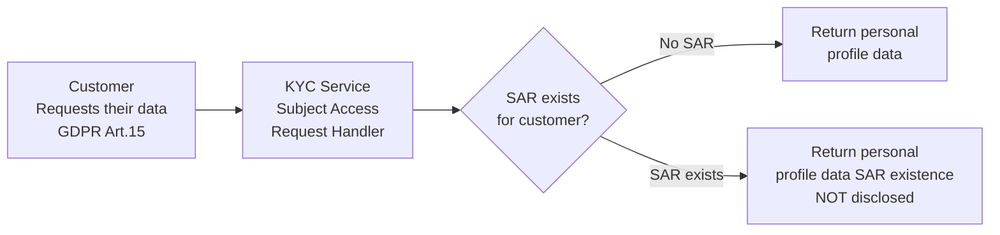

# Data Protection & GDPR Compliance

## GDPR Subject Access Request (SAR) Handling

**Overview:** When a customer requests their personal data (GDPR Article 15), Lucidex must:
1. Return all personal data held about them
2. **NOT disclose** if a compliance SAR exists (bank secrecy)
3. Provide evidence of data processing

**Key Design:**
-  Customer data returned in both cases
-  SAR existence is **confidential** (bank secrecy privilege)
-  Only encrypted SAR blobs stored in Lucidex
-  Audit trail maintained in AuditLog for compliance