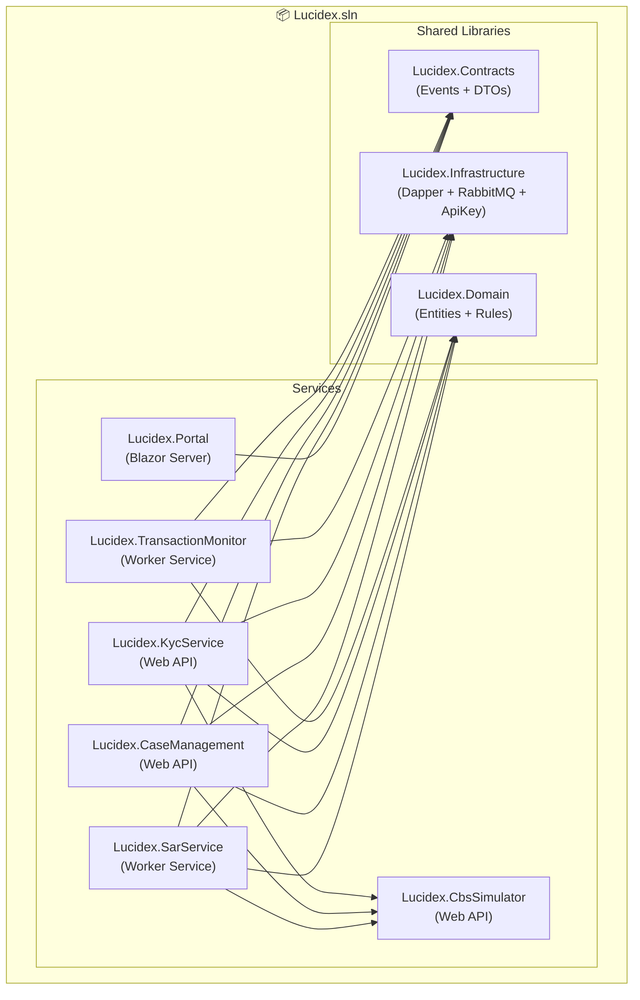

```mermaid
graph TD
    subgraph SLN["📦 Lucidex.sln"]
        subgraph SVC["Services"]
            A["Lucidex.TransactionMonitor\n(Worker Service)"]
            B["Lucidex.KycService\n(Web API)"]
            C["Lucidex.CaseManagement\n(Web API)"]
            D["Lucidex.SarService\n(Worker Service)"]
            E["Lucidex.Portal\n(Blazor Server)"]
            F["Lucidex.CbsSimulator\n(Web API)"]
        end

        subgraph SHARED["Shared Libraries"]
            G["Lucidex.Contracts\n(Events + DTOs)"]
            H["Lucidex.Infrastructure\n(Dapper + RabbitMQ + ApiKey)"]
            I["Lucidex.Domain\n(Entities + Rules)"]
        end
    end

    A --> G
    B --> G
    C --> G
    D --> G
    E --> G
    A --> H
    B --> H
    C --> H
    D --> H
    B --> F
    C --> F
    D --> F
    A --> I
    B --> I
    C --> I
    D --> I
```